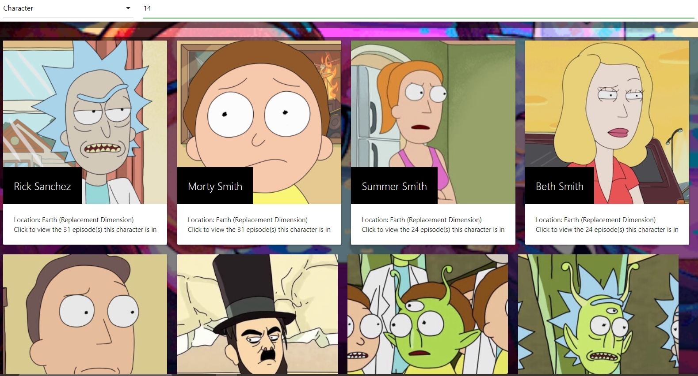
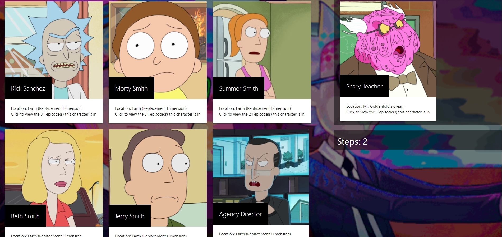
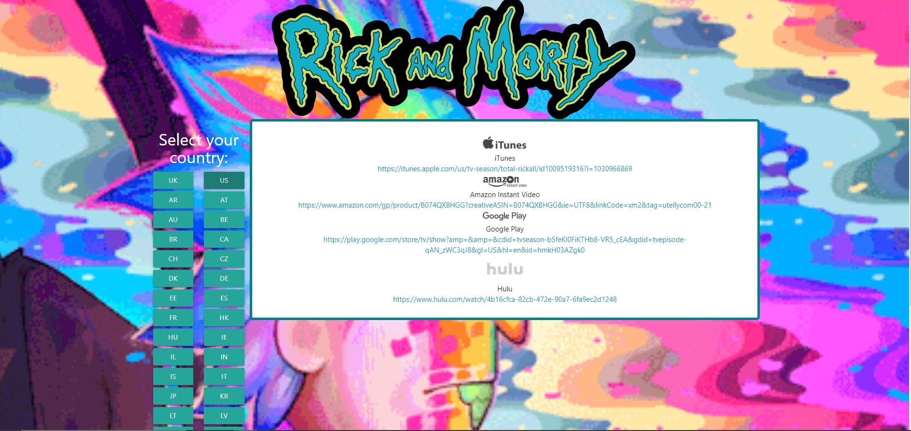

# Rick-and-Morty
https://rforde1.github.io/Rick-and-Morty/
 

### Contributors
    Garrett Reichman
    Rami Forde
    Samad Ali

## Description
   This project was made to display our abilities in regards to front end development. The UI was made using HTML and Materialize's stylings and components. The interactivity was achieved using Jquery and javascript. The application queries the Rick and Morty api to retrieve information about requested characters, locations, and/or episodes. It then created card elements using that information, then displays them to the screen. Each card also contains click listeners, allowing the user to traverse between search results. The 2nd page allows the user to play a trivia style game, where they must try to move from the starting character to the target character with as few transitions as possible. The 3rd page uses the utelly and geolocation api to allow the user to find where they can watch Rick and Morty in their country, or one of the countries listed in the field of buttons.

## Usage

   ### Home
    
   When the page is first loaded, it will default to the wiki page where you may search for characters/episodes/locations by name or id. Each result will display the information about the target as well as provide clickable text that allows the user to traverse all available results related to it. The navbar at the top of the page can be used to change to either the game page or the where to watch page.

   ### Game
   When the game page is loaded, the user will be prompted with a button to begin the game. Once the game starts, the starting character will be displayed on the left, with the target character and number of moves taken displayed on the right. The user will then have to use the results given about the character to view either the location or episode(s) the character is found in. This process will continue with the user traversing from characters to episode/location back to characters until the target character has been found. The step counter is incremented every time new characters are displayed. Once the target has been found, both sides will show the same character and the game will be over.

 
   ### Where to Watch
   When the where to watch page is loaded, the user will be asked to allow the site to access their location. If they accept, the application will use their current location to attempt to display where to watch the show in their country. Afterwards, the user may use the buttons shown on the left side of the page to view links to various platforms where Rick and Morty is available in their country.

## Resources
Rick and Morty api: https://rickandmortyapi.com/
 
Utelly api: https://rapidapi.com/utelly/api/utelly
 
Geolocation api: https://developer.mozilla.org/en-US/docs/Web/API/Geolocation_API
 
Materialize CSS: https://materializecss.com/
 
Reverse Geo-location: https://rapidapi.com/Noggle/api/reverse-geocoding-and-geolocation-service
